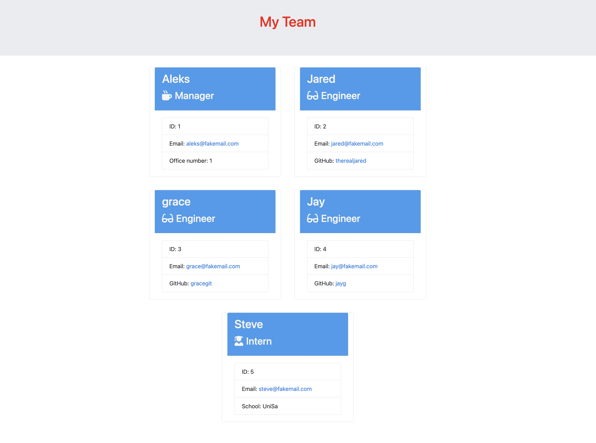

# Team Dashboard  Generator

## Description
The project was made to help the needs of managers that want to generate a dashboard that display's their team basic info to keep track of the team and to access their emails and github profiles quickly.

## Table of Contents
- [Installation](#installation)
- [Usage](#usage)
- [Licence Description](#licence-description) 
- [Questions](#questions)

## Installation
To install this project you need to have node installed in order to call the application on the command line, and to install required packages with command npm install on the command line.

## Usage 

       
       

## Licence Description
This project is licensed under the MIT License - see the [MIT License](https://opensource.org/licenses/MIT) for details.

## Questions
In this section, you will find links to my GitHub and email address to contact me if you have any questions or you want to chat about the project.

[GitHub Profile](https://github.com/Aleks-Ianu)

[Email Me](mailto:ianu.aleks@gmail.com)
